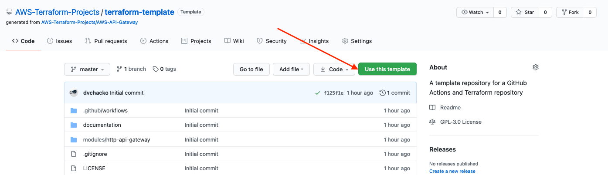

# An Template Repository using GitHub Actions and Terraform

> A template repository for provisioning AWS resources using Terraform. The template supports both Terraform Cloud or AWS S3 to manage the the project's remote files. GitHub Actions is used to implement the CI/CD pipeline
>
> Please see the  for detailed instructions on using this template repository

##### Create a new repository using this repository as a template. Click on the `Use this template` button as shown below
  
  <kbd></kbd>
  
### Installing and running this project

  
Prerequisites for running this project

  
### The project has the following dependencies  
- AWS CLI version 2. To install the AWS CLI, please see [Installing, updating, and uninstalling the AWS CLI version 2](https://docs.aws.amazon.com/cli/latest/userguide/install-cliv2.html)
- Terraform CLI 0.14.2 . To install Terraform CLI, please see [Install Terraform](https://learn.hashicorp.com/tutorials/terraform/install-cli?in=terraform/aws-get-started)

  
Initialize and run this project

   
  
Please see the  for detailed instructions on using this template repository
 

